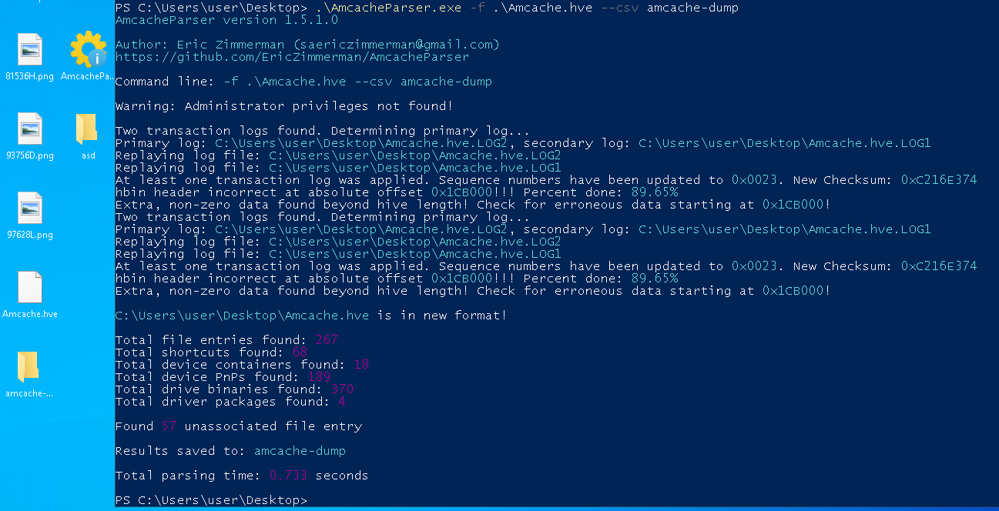
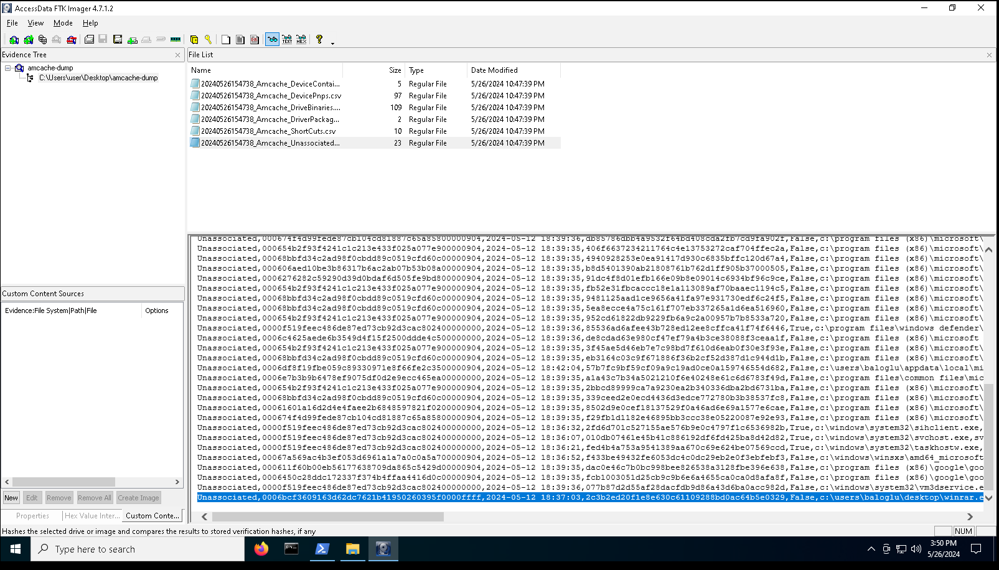

First we see that these file are amcache dumps.
We can parse these using https://github.com/EricZimmerman/AmcacheParser


Then we can inspect these csv files manually:

Here we can see that winrar.exe is started from the desktop, this is not usual of winrar.exe since programs like winrar reside in `program files` folders.

```
Unassociated,0006bcf3609163d62dc7621b41950260395f0000ffff,2024-05-12 18:37:03,2c3b2ed20f1e8e630c61109288bd0ac64b5e0329,False,c:\users\baloglu\desktop\winrar.exe,winrar.exe,.exe,2022-09-13 23:30:57,,151040,,,winrar.exe|b5056d353bf85dc4,pe32_i386,False,,,34585792,0,
```

Using the flag format guidance in challenge description.

And voila! We got our flag!
```
GOP{winrar.exe:2c3b2ed20f1e8e630c61109288bd0ac64b5e0329}
```
