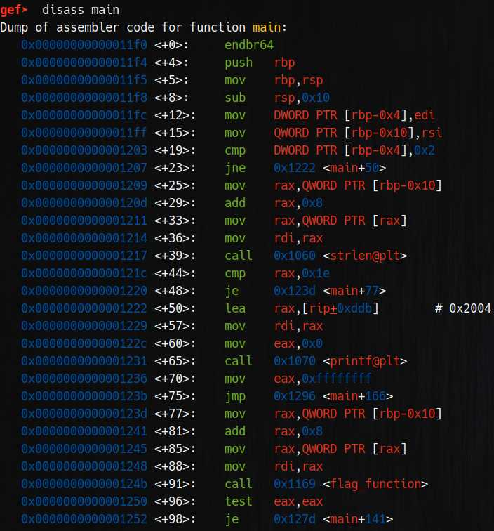
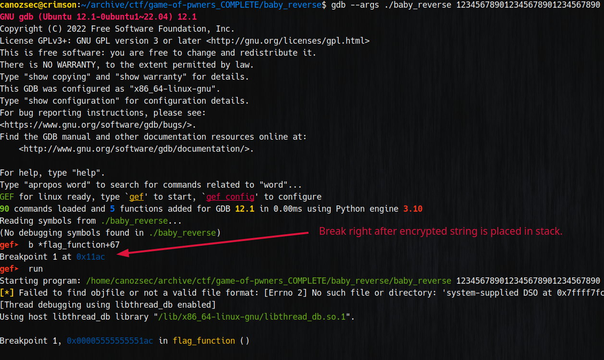
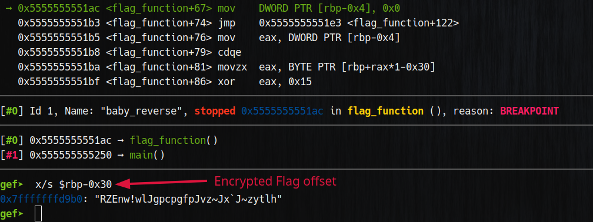
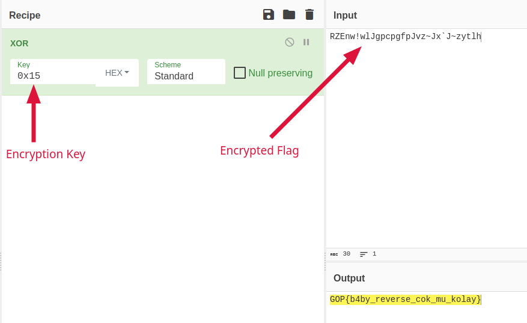

We can see that the argv is the key argument here and there is a check for it's size which is 0x1e -> 30 characters.


We open up gdb for the dynamic analysis and set it's arguments to pass key size check.

We put a breakpoint right after encrypted string is pushed into stack and inspect the stack right after.

After we got the encrypted flag we use xor function with key `0x15` hex.


And voila! We got our flag!
```
GOP{b4by_reverse_cok_mu_kolay}
```