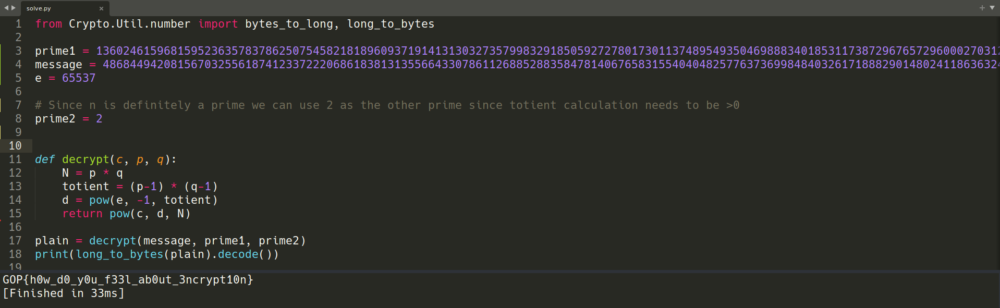

Here using factordb.com we can see that our N is a prime number which means we literally know p and it's enough to derive the d.


Using 2 as q we can use a generic rsa decryption function.

And voila! We got our flag!
```
GOP{h0w_d0_y0u_f33l_ab0ut_3ncrypt10n}
```