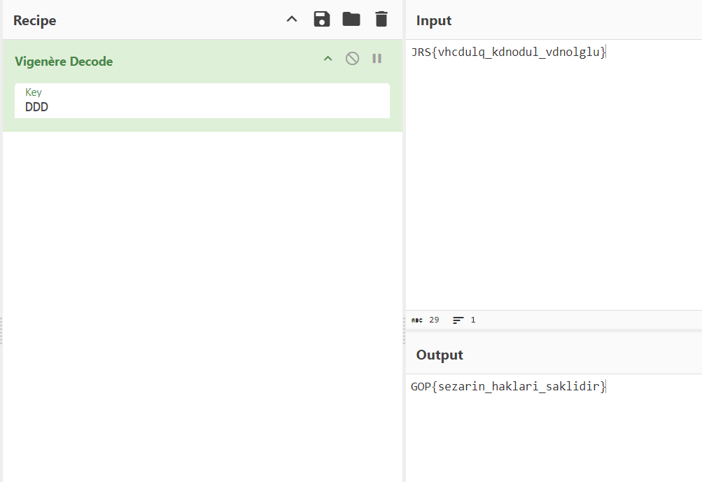

# Brute

```
JRS{vhcdulq_kdnodul_vdnolglu}
```

When I saw our password, I thought of the previous question, Vigo, and I thought that this could also be a Vigenère password.

*Let's find our key using the techniques described in more detail in Vigo.

Since we know that our flag format is GOP{...}, we will easily find our key. Let's calculate our Vigenère key based on the plaintext "GOP" and the ciphertext "JRS".

Numeric Values of Letters: Let's start by converting each letter into a numeric value in alphabetical order.

G = 6

O = 14

P = 15

J = 9

R = 17

S = 18

Key Calculation: We find the key by subtracting the plaintext from the ciphertext and take mod 26.

First letter J (9) - G (6) = 3 --> D
Second letter: R (17) - O (14) = 3 --> D
Third letter: S (18) - P (15) = 3 --> D
Key Result: Our key letters are found as **DDD**.

As a result, the Vigenère key will be "**DDD**". Using this key, the plaintext "GOP" is translated into the ciphertext "JRS".

Let's use CyberChef again for this part.


Here's our flag.