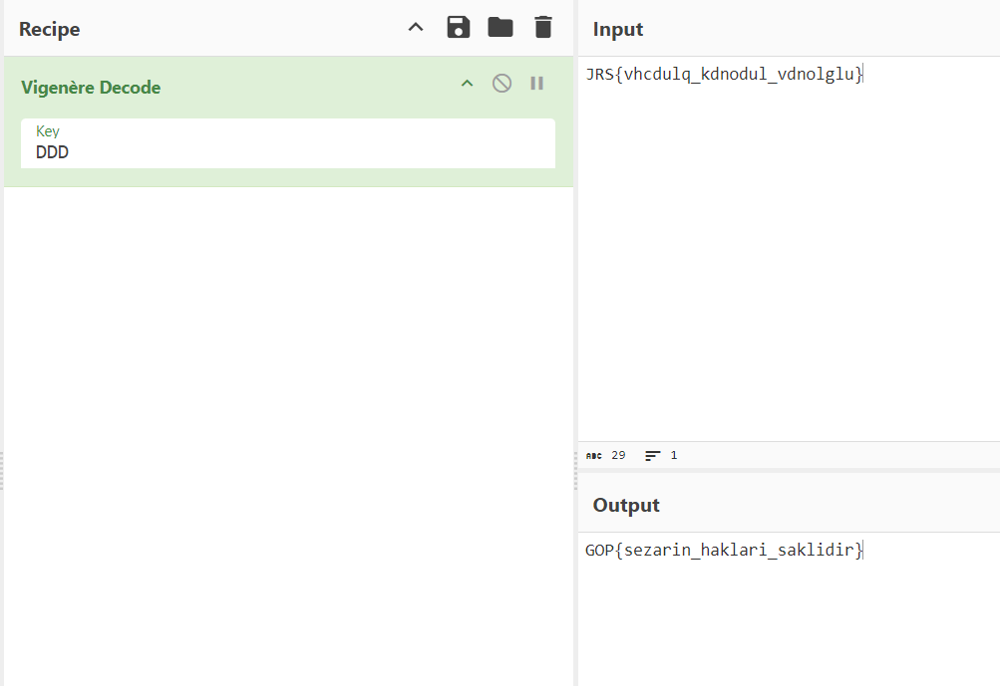

# Brute

```
JRS{vhcdulq_kdnodul_vdnolglu}
```

şifremizi görünce yine bir önceki soru olan Vigo aklıma geldi ve bunun da bir Vigenère şifresi olabileceğini düşündüm.

*Sonra Vigo'da daha ayrıntılı olarak anlatılan teknikleri kullanarak keyimizi bulalım.*

Flag formatımızın GOP{...} şeklinde olduğunu bildiğimiz için kolaylıkla keyimizi bulacağız. "GOP" düz metni ile "JRS" şifreli metni üzerinden Vigenère anahtarımızı hesaplayalım.

Harflerin Sayısal Değerleri: Her harfi alfabetik sıraya göre sayısal bir değere dönüştürerek başlayalım.

G = 6

O = 14

P = 15

J = 9

R = 17

S = 18

Anahtar Hesaplama: Şifreli metinden düz metni çıkartarak anahtarı buluruz ve mod 26 alırız.

İlk harf: J (9) - G (6) = 3 --> D
İkinci harf: R (17) - O (14) = 3 --> D
Üçüncü harf: S (18) - P (15) = 3 --> D
Anahtar Sonucu: Anahtar harflerimiz **DDD** olarak bulunur.

Sonuç olarak, Vigenère anahtarı "**DDD**" olacaktır. Bu anahtar kullanılarak "GOP" düz metni "JRS" şifreli metnine çevrilmiştir.

Bu kısımda yine CyberChef'ten yararlanalım.


İşte flagimiz hazır.