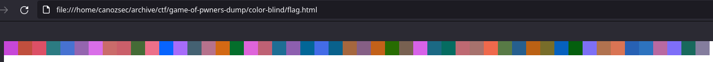
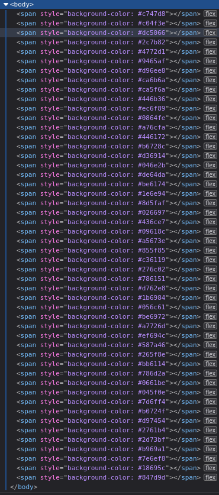
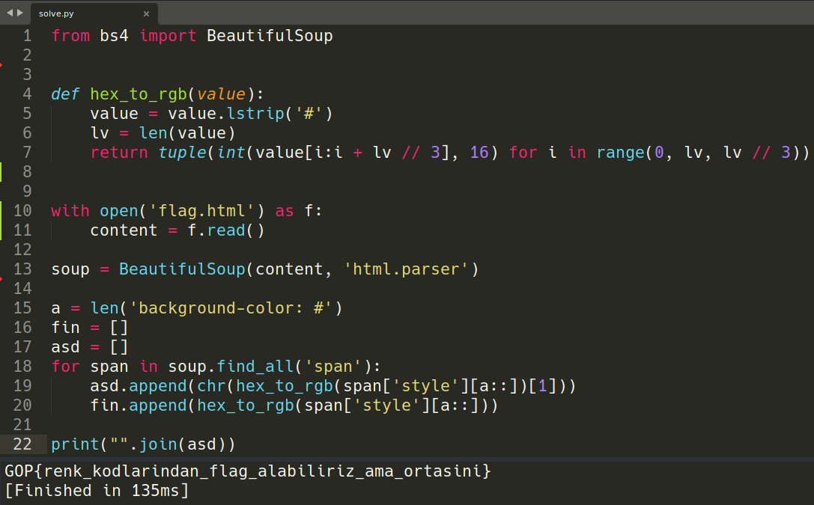

We can see that this is a line of colors in html.<br>

Here we can see they used span to put these colors.<br>

<br>

<br>
We can parse these values using BeautifulSoup and take the green channel as ascii values, put them into a list and print the list.

And voila! We got our flag!
```
GOP{renk_kodlarindan_flag_alabiliriz_ama_ortasini}
```
