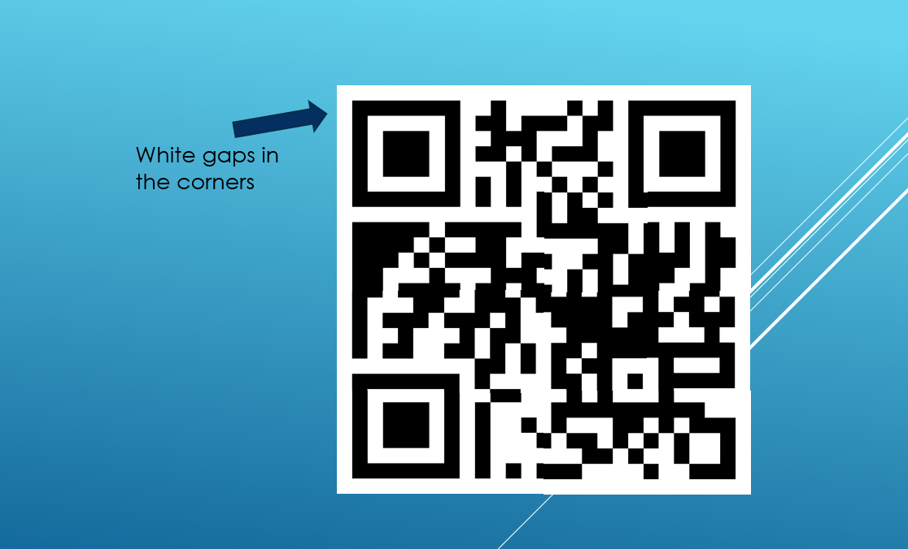

# Explode

In this question we are given a zip and qr pieces inside. There is a white line in the corner photos of the qr and when we follow this line, we assemble the puzzle.

First of all, I think of power point and I organize the pictures by throwing them in bulk.

We have obtained the QR code. When we scan it, we find our flag as **GOP{fl4g_param_param_olca_oldu}**.