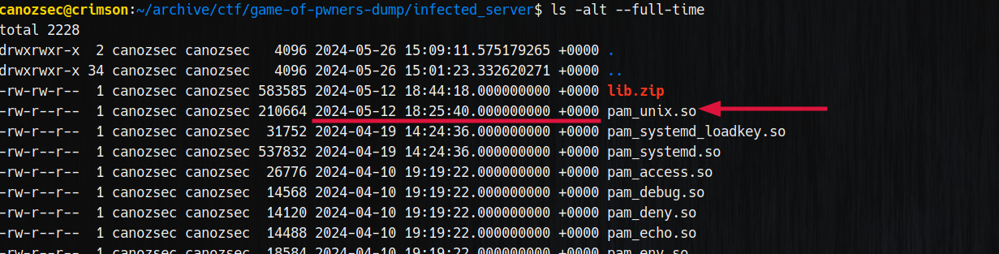

First we start by extracting the archive then we can see last edited pam files by sorting by date.

Usually the timestamp ends with `.000000000` and backdoors can be detected if this part is different from `.000000000`.
Here this is not the case but the date for backdoored file is very different from legitimate files.
We can also detect this specific backdoor using these grep commands:
https://gist.github.com/bcoles/b66c0116daa1d1d2623e0d2a2795304f


Here we can see this backdoor is https://github.com/zephrax/linux-pam-backdoor

Reversing it we found this:


Here we can get the password since it's in plaintext.
Using the password we can login via ssh however we couldn't make it work with btk's internet connection so we used ours.

```
root:chipichipichapachapa
```

And voila! We got our flag!
```
GOP{ssh_backdoor_is_not_a_good_idea}
```
