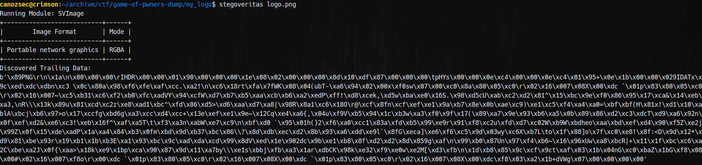
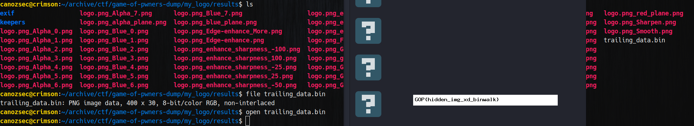

In this challenge I just ran stegoveritas to get trailing data and that data turned out to be an image file that contains the flag.




And voila! We got our flag!
```
GOP{hidden_img_xd_binwalk}
```
