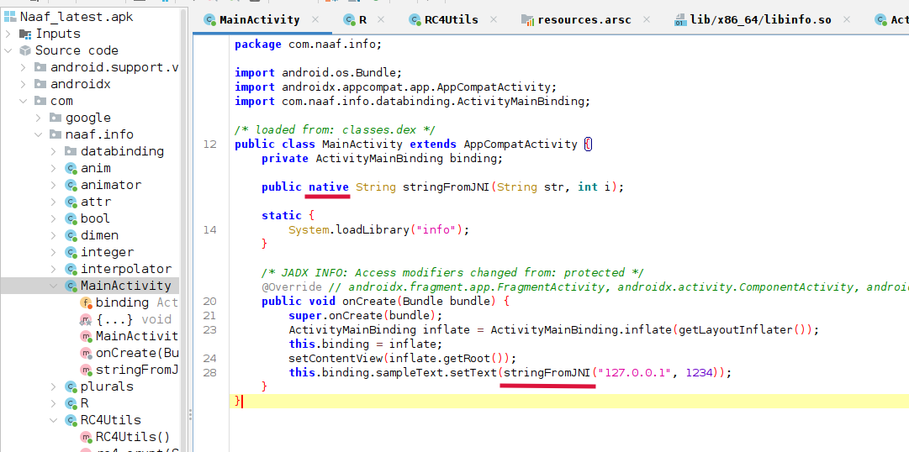
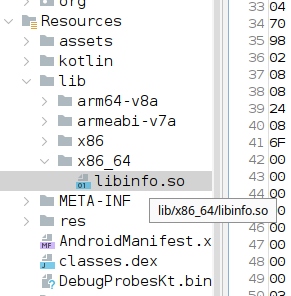
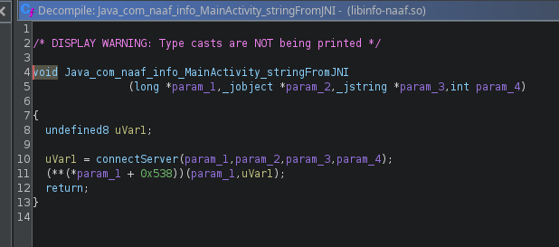
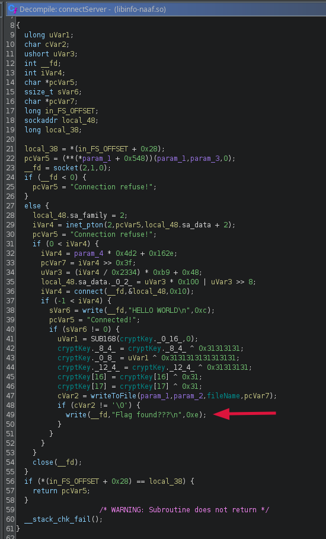
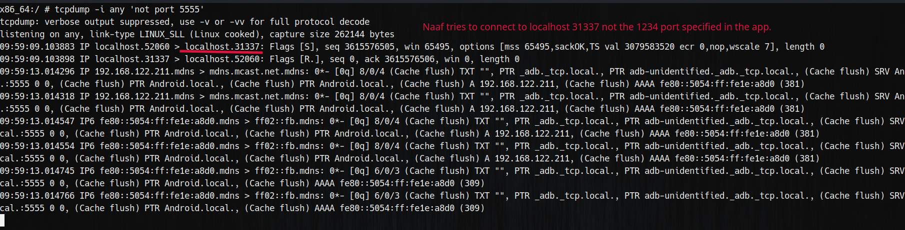
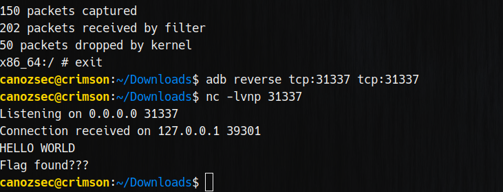
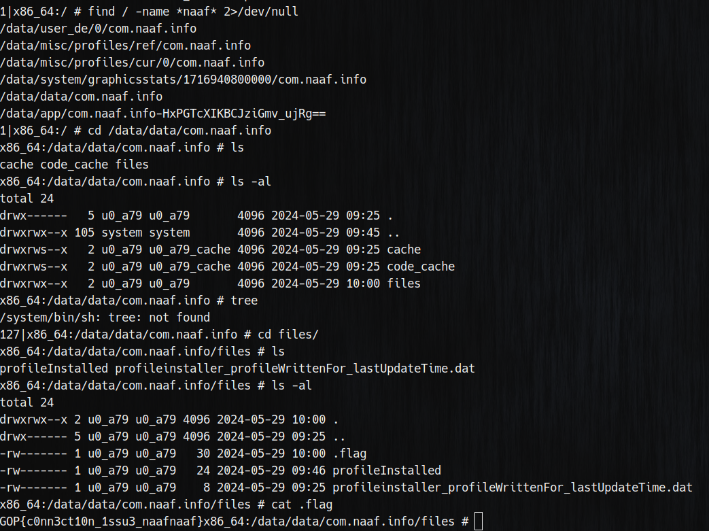

Although we haven't been able to solve the challenge at the time. We have solved it after the event.<br>

First we use jadx to disassemble this app's source code. Thankfully it wasn't obfuscated. Here we can see the app does some sort of network connection using native function `stringFromJNI`.<br>

<br>
Here we found the native library that holds the logic for this function:<br>

<br>
Disassembling it using ghidra:<br>

<br>
Here we can see the app tries to connect to a server. And if it's being able to connect it will send some strings to this address and call writeToFile function.<br>

<br>
We can check which port it will connect to dynamically using: 
```
tcpdump -i any 'not port 5555'
```
Since we use adb on port 5555 filter `not port 5555` will get rid of some noise. 
<br>
We can see it makes a connection to `localhost:31337`

<br>
Using adb reverse we can forward this port to our host machine, and listen on the port using netcat.<br>

<br>
Here we can see the application writes the flag into `/data/data/com.naaf.info/files/.flag`<br>

<br>
And voila! We got our flag!
```
GOP{c0nn3ct10n_1ssu3_naafnaaf}
```
