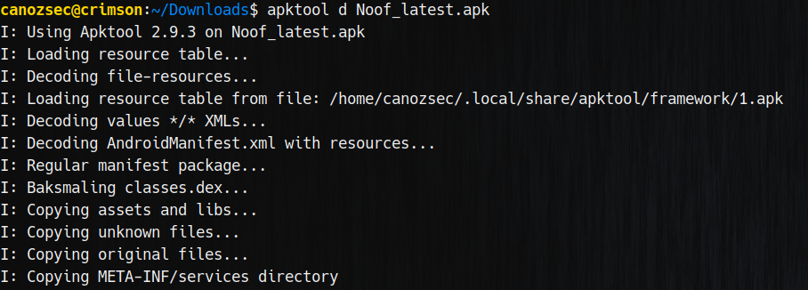
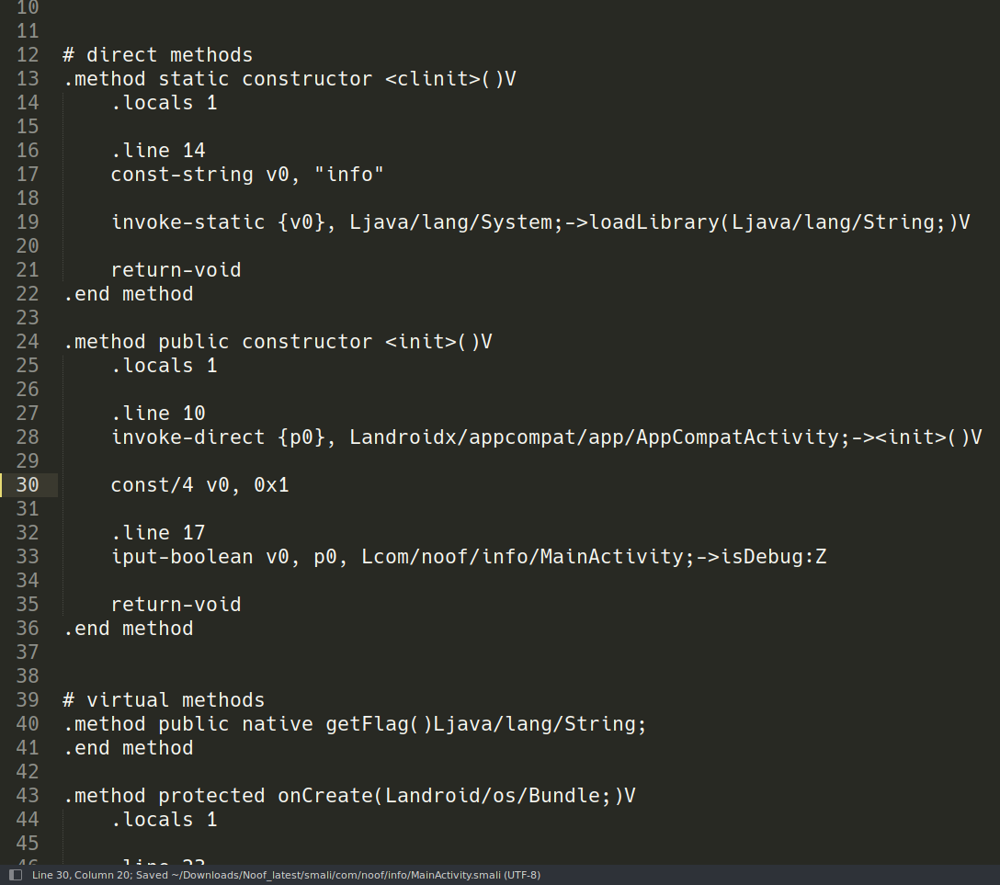

Although we haven't been able to solve the challenge at the time. We have solved it after the event.<br>

First we use jadx to disassemble this app's source code. Thankfully it wasn't obfuscated. Here we can see there is a check for isDebug field. If we can set this to true we can progress further.<br>

<br>
Using apktool we can decompile this apk into a folder, then edit the smali file and finally recompile and sign the apk.<br>

<br>
Here we edit the part that initializes this variable: `const/4 v0, 0x0` -> `const/4 v0, 0x1`<br>

<br>
Then let's recompile:<br>

<br>
We also need to sign the app:<br>

<br>
Running it:<br>

<br>
Disassembling native library using ghidra:<br>

<br>
There is a check for package `com.topjohnwu.magisk` using function `isPackageInstalled`, basically it checks if `magisk` is installed if it's installed it will return 1 and block us from getting the flag.
<br>
 <br>
There are also checks for `com.wallet.crypto.trustapp`, `exodusmovement.exodus` and `com.noof.crypt`.
We can bypass these checks by hooking the `isPackageInstalled` function right after the library is loaded into memory. To do that we need to write a frida script that will hook the function like so: <br>
```js
function hookNativeFunction() {
    var LibInfoBaseAddr = Module.getBaseAddress("libinfo.so");
    send("Got library base address: " + LibInfoBaseAddr);
    var isPackageInstalledAddr = LibInfoBaseAddr.add(0x21270);
    send("Got isPackageInstalled address: " + isPackageInstalledAddr);
    var ret;
    Interceptor.attach(isPackageInstalledAddr, {onEnter: function(args){
        send("[*] Function is called! with args " + args[1].readUtf8String());
        if (args[1].readUtf8String() == "com.topjohnwu.magisk"){
            ret = 0;
        }
        else {
            ret = 1;
        }
    }, onLeave: function(retval){ retval.replace(ret); }});
}

Java.perform(function() {
    const System = Java.use('java.lang.System');
    const Runtime = Java.use('java.lang.Runtime');
    const SystemLoad_2 = System.loadLibrary.overload('java.lang.String');
    const VMStack = Java.use('dalvik.system.VMStack');

    SystemLoad_2.implementation = function(libname) {
        send("Loading dynamic library => " + libname);
        const loaded = Runtime.getRuntime().loadLibrary0(VMStack.getCallingClassLoader(), libname);
        send("Loaded dynamic library => " + libname);
        hookNativeFunction();
        return;
    }
})
```
<br>
Here we basically hook `System.loadLibrary()` and when a native library loads we call `hookNativeFunction()` which basically gets the base address of the native library.<br>
We then calculate `isPackageInstalledAddr` using static offset of `0x21270`, then we attach an interceptor for this function using the `isPackageInstalledAddr`. by doing this we effectively hooked the function and can change the return value to be whatever we want.<br> 
Here we check if `args[1]` equals to the string `com.topjohnwu.magisk`, if that's the case we return `0` . If that's not the case we return `1`. <br>
We basically bypassed all the checks and we can get the flag!
<br>

<br> 

<br>
And voila! We got our flag!
```
GOP{M0b1le_nat1ve_noofnoof_naafnaaf}
```
