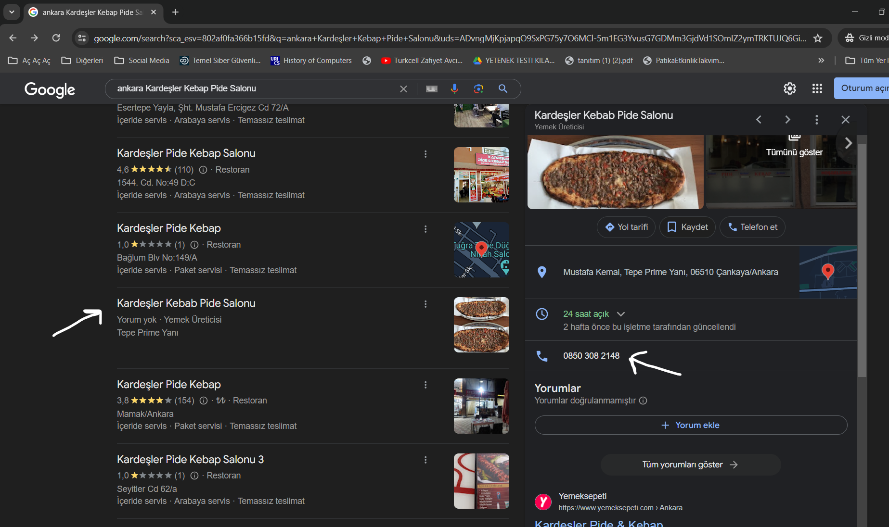

# Police Raid

In this question we are looking for a 'Kardeşler Kebap Pide Salonu' and it is said to be in Ankara, when we searched this newly opened kebab shop on the internet and then

we come across a kebab shop with no reviews.

We call the phone number and he asks us for the extension number.

**The conversation goes something like this:**

*-Welcome to Kardesler Kebap Pide Salonu. If you know the extension number, please dial it. If not, please wait for operator assistance.*

When we wait, the phone hangs up. However, we think of the code 1337 in the question and when we dial this as the extension number,

*-lahmacunpidedendahaiyi*

we get the answer from the other party.
Our flag is: GOP{lahmacunpidedendahaiyi}

Kardesler Kebap Pide Salonu:
*https://www.google.com/maps/place/Karde%C5%9Fler+Kebab+Pide+Salonu/@39.9090353,32.7546614,17z/data=!3m1!4b1!4m6!3m5!1s0x14d3474219bec497:0xddfd12278e122e46!8m2!3d39.9090353!4d32.7546614!16s%2Fg%2F11vzgc10d3?hl=tr&entry=ttu*