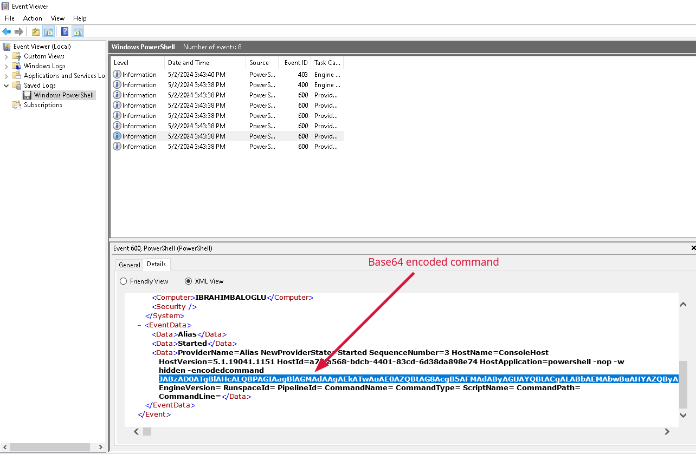
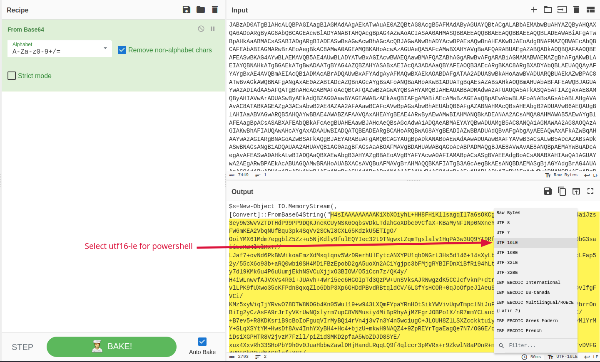
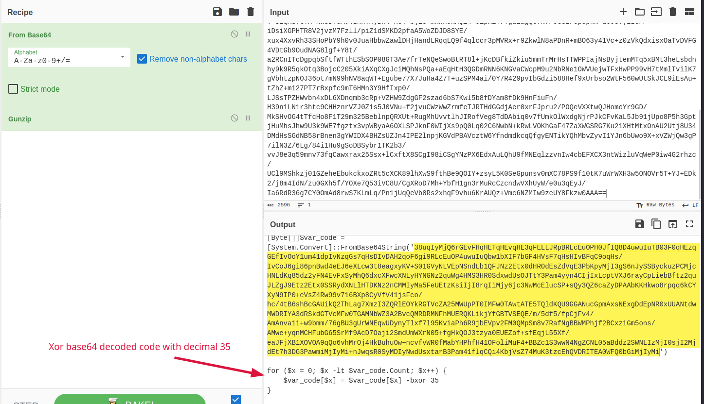
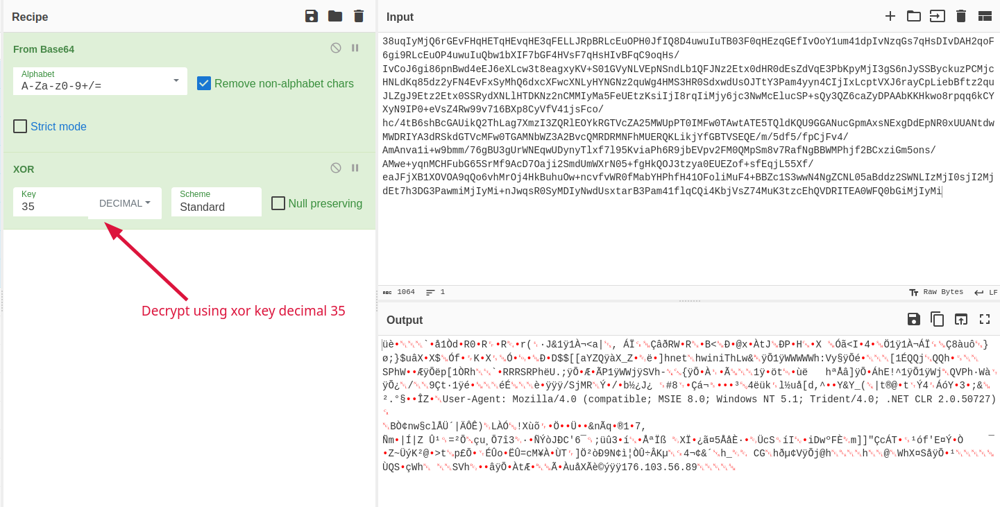
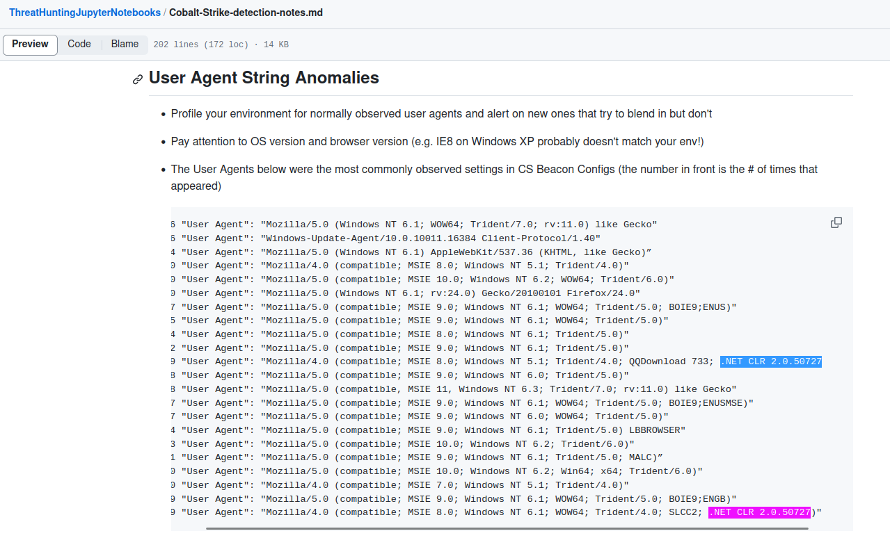
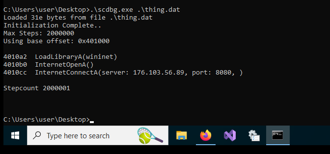

Since this is an event log file I opened it in my windows vm.
This log only contains powershell commands so I checked one of them.


Here we have a base64 encoded powershell oneliner. 
We decode the powershell command and encode it with utf-16le so we can read it properly.


Here we take the base64 blob and decode it once again then decompress using gunzip.


Here we decode yet another base64 blob and xor it using decimal 35 xor key.

Here we can see it's a cobalt strike stager. 


We extract the config using scdbg.exe


And voila! We got our flag!
```
GOP{176.103.56.89:8080}
```
