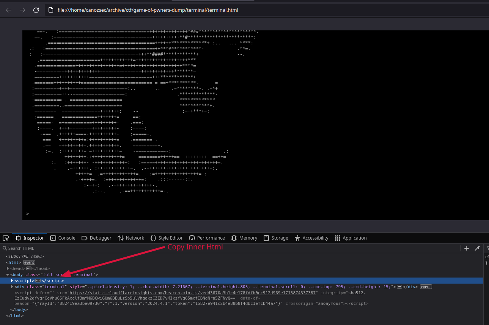
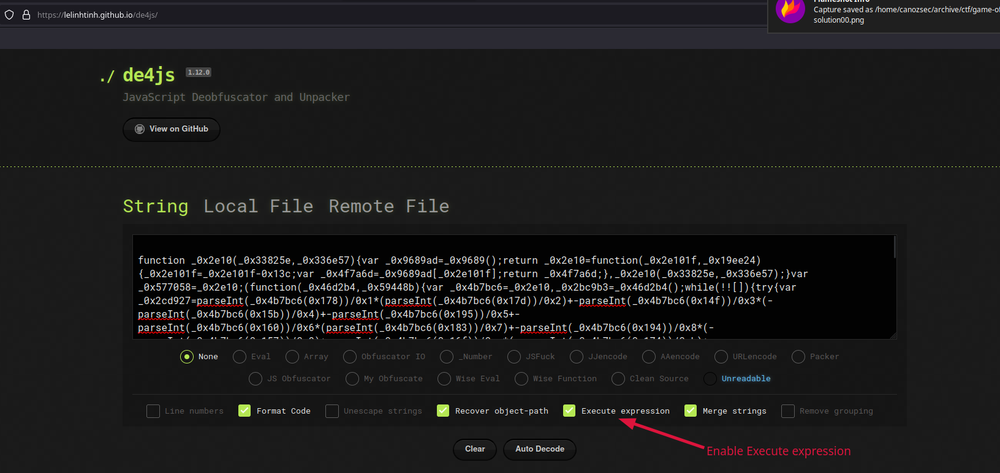
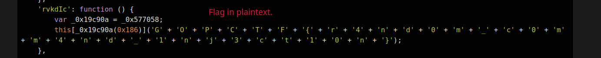
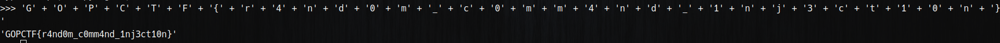

First we inspect the source and copy the obfuscated javascript blob:

Then we paste it on de4js and enable execute expression

Then we inspect the source and find flag in plaintext.

We can easily concat these strings using python interpreter.


And voila! We got our flag!

```
GOPCTF{r4nd0m_c0mm4nd_1nj3ct10n}
```
