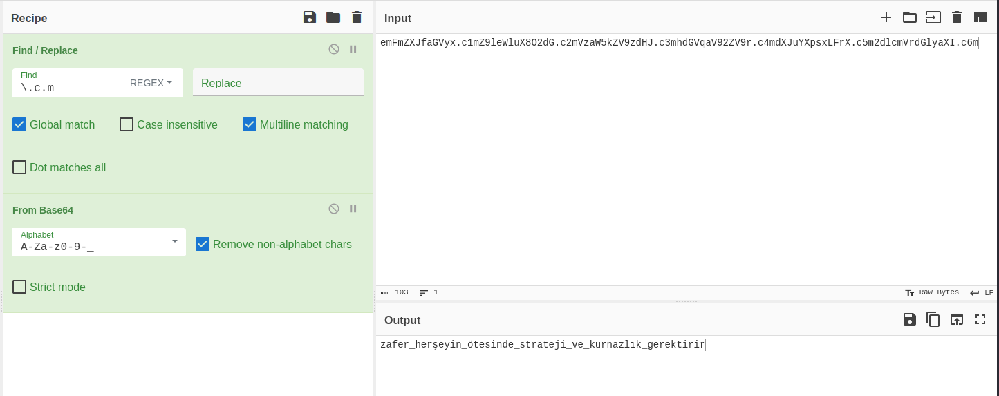

In this challenge we are given an pcap file.
After inspecting the pcap file for a while we found that there are failed dns queries.
We can filter these dns queries by `dns.flags == 0x8183`


Here we copy every query name and put them in cyberchef in order like so:

Then we delete the `.c{number}m` tlds and base64 decode it.

And voila! We got our flag!
```
GOP{zafer_herşeyin_ötesinde_strateji_ve_kurnazlık_gerektirir}
```
