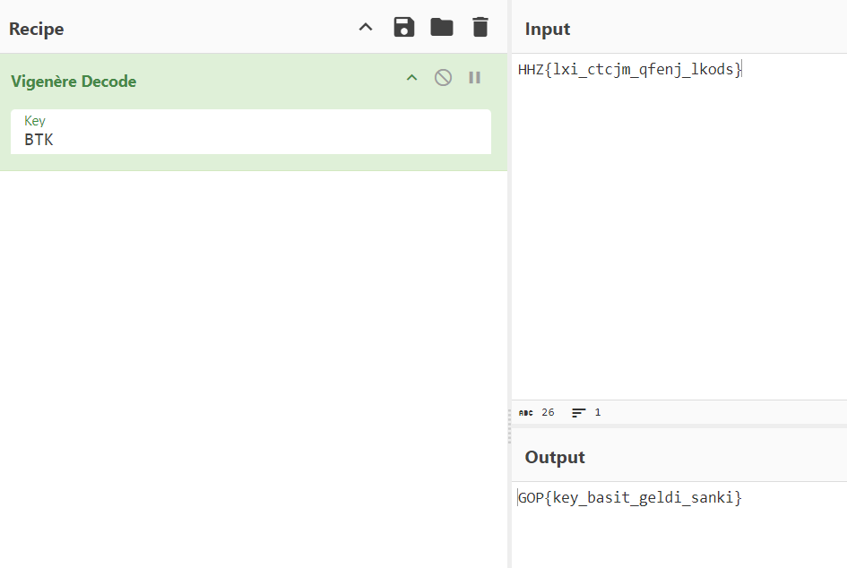

 # Vigo

You need to find a key to decrypt this encrypted message. The message is as follows:

```
HHZ{lxi_ctcjm_qfenj_lkods}

It's simple, but you have to find the key
```

From the clue, we know that we need to find a key, hence the Vigenère cipher.

*The Vigenère cipher is a classical encryption method developed by Blaise de Vigenère in the 16th century. It is used to encrypt one text with another text and has an important place in the history of cryptography.*

Since we know that the format of the flag we need to find is **GOP{...}**, we try to find the key based on this.

In the Vigenère cipher, we can follow certain steps to find the key between a given plaintext and ciphertext. Let's explain these steps for the plaintext “**GOP**” and the ciphertext “**HHZ**”.

Numerical Values of Letters: We assign a numerical value to each letter of the alphabet (A = 0, B = 1, C = 2, ..., Z = 25).

G = 6

O = 14

P = 15

H = 7

H = 7

Z = 25

Key Calculation: To find the key, we subtract the plaintext letter from the cipher letter and take mod 26 (because the alphabet consists of 26 letters).

First letter: H (7) - G (6) = 1 --> B
Second letter: H (7) - O (14) = -7 (mod 26) = 19 --> T
Third letter Z (25) - P (15) = 10 --> K

Let us examine these operations in more detail:

H - G = 7 - 6 = 1 (B)
H - O = 7 - 14 = -7 (mod 26) = 19 (T)
Here we take -7 mod 26 and calculate it as follows: -7 + 26 = 19.Z - P = 25 - 15 = 10 (K)

Key Result: Our key letters are found as **BTK**.

As a result, the Vigenère key will be “BTK”. Using this key, the plaintext “GOP” is translated into the ciphertext “HHZ”. Now that we have found the “BTK” key, let's use online tools to translate the whole ciphertext. CyberChef will be useful for this.


We write our key and text to CyberChef and that's it, we find our flag.
